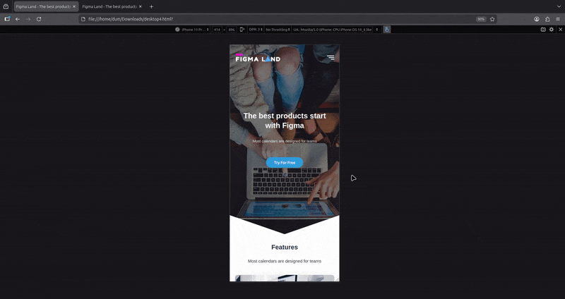
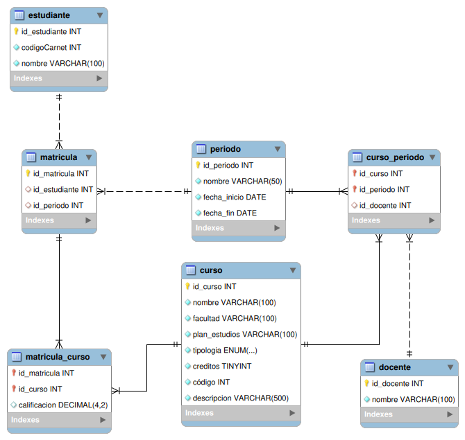

# # Prueba convocatorias UAPA

## - Prueba Front-End: 
Para correr el front basta con dar doble clik en el archivo MockupsCode.HTML (o abrirlo con el navegador) que se encuentra en la carpeta frontend (recordar que el styles.css debe estar descargado en la misma carpeta)

Acontinuación los resultados:

  
  
<em>vista en desktop </em>

  
  
<em>vista responsive </em>

## - Prueba SQL: 
Para probar el sql seguir los siguientes pasos con los archivos que se encuentran en la carpeta "SQL":

1. Correr el script de creacion de la base de datos llamado "CREATION.sql"

2. Poblar las tablas corriendo el script llamado "POBLATE.sql"

3. Las Consultas que responden a las preguntas  se encuentran en el archivo "QUERYS.sql"

Modelo entidad relación:

  
  
<em>EER </em>

